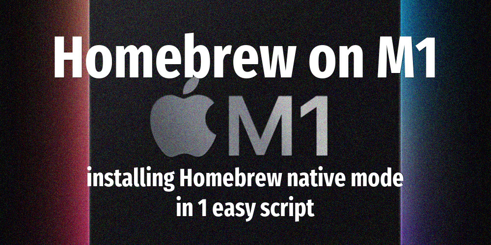
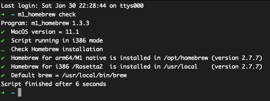
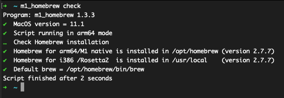

[](https://basher.gitparade.com/package/)


# Using Homebrew on Apple Silicon M1 (MacOS Big Sur) 



## Usage

    Program: m1_homebrew.sh 1.2.0 by peter@forret.com
    Updated: Dec 22 21:41:12 2020
    Usage: m1_homebrew.sh [-f] [-h] [-q] [-v] [-a <architecture>] [-l <log_dir>] [-t <tmp_dir>] <action> <package?>
    Flags, options and parameters:
    -f|--force       : [flag] do not ask for confirmation (always yes) [default: off]
    -h|--help        : [flag] show usage [default: off]
    -q|--quiet       : [flag] no output [default: off]
    -v|--verbose     : [flag] output more [default: off]
    -a|--architecture <?>: [option] install in arm64 or i386 mode  [default: auto]
    -l|--log_dir <?> : [option] folder for log files   [default: /Users/pforret/log/m1_homebrew]
    -t|--tmp_dir <?> : [option] folder for temp files  [default: /Users/pforret/.homebrew]
    <action>         : [parameter] action to perform: check/install/uninstall/recursive
    <package>        : [parameter] package to recursive install (optional)
    
    ### TIPS & EXAMPLES
    * use `m1_homebrew check` to check if Homebrew is installed for Rosetta and/or native mode
    * use `m1_homebrew install` to install Homebrew
    * use `m1_homebrew uninstall` to uninstall Homebrew
    * use `m1_homebrew recursive package` to install a package from source but first build its dependencies
    * >>> bash script created with pforret/bashew
    * >>> for developers, also check pforret/setver

### m1_homebrew check

Check what version of Homebrew are installed for i386 and arm64 mode.

Running `m1_homebrew check` on Intel/Rosetta2:


Running `m1_homebrew check` on M1/ARM64:



### m1_homebrew install

* install Homebrew in arm64 mode (without Rosetta 2) on a Apple M1 computer (MacOS Big Sur)
* install Homebrew in i386 mode (with Rosetta 2) on a Apple M1 computer (MacOS Big Sur)

Output is like this:
```
Program: m1_homebrew.sh 1.2.0
✔  MacOS version = 11.1
✔  Script running in arm64 mode
Are you sure you want to install Homebrew for arm64 to /opt/homebrew? [y/N] Y 
…  Create folder for [/opt/homebrew] Homebrew ...
…  Download Homebrew into [/Users/pforret/.homebrew] ...
✔  After download: Homebrew folder is 15 MB
✔  After update  : Homebrew folder is 64 MB                                      
✔  After install : Homebrew folder is 463 MB                                           
…  Move Homebrew files to /opt/homebrew
Create folder share/zshet/.homebrew/SECURITY.md ...                                                   
Create folder share/zsh/site-functions
Create folder Caskroom
✔  All files moved to /opt/homebrew                           
HOMEBREW_VERSION: 2.7.0-24-g53ef74f
Script finished after 84 seconds
```  

### Using native Homebrew

* as long as Homebrew does not officially support Apple M1 ARM architecture, 
  you will get the following warning every time you try to `brew install` a package

```  
Warning: You are running macOS on a arm64 CPU architecture.
We do not provide support for this (yet).
Reinstall Homebrew under Rosetta 2 until we support it.
You will encounter build failures with some formulae.
Please create pull requests instead of asking for help on Homebrew's GitHub,
Twitter or any other official channels. You are responsible for resolving
any issues you experience while you are running this
unsupported configuration.
```  

* you can however install the package by using `brew install -s`, 
  which is short for `brew install --build-from-source`
* packages with lots of dependencies (like e.g. ffmpeg) will often stop with the following error:
```  
Error: [some package]: no bottle available!
You can try to install from source with e.g.
brew install --build-from-source [some package]
```  
* you have to `brew install --build-from-source` that dependency first, 
  and run the main `brew install` again
* you might have to do thius for every missing dependency, or use ...

### m1_homebrew recursive package

* **_recursive_ brew install -s** !!
* `m1_homebrew recursive ffmpeg` will first look up all the dependencies of ffmpeg, 
  build those one after the other and then run the main `brew install`. 
  It will take some time, but it works!


### m1_homebrew uninstall

* if you prefer running in 'Rosetta 2' mode, you can uninstall the native mode Homebrew.
* run as: `curl -s https://raw.githubusercontent.com/pforret/macos_m1_cli/main/uninstall_homebrew_native.sh | bash`

Output is like this:
```  
Program: m1_homebrew.sh 1.2.0
✔  MacOS version = 11.1
✔  Script running in arm64 mode
Are you sure you want to uninstall Homebrew for arm64 from /opt/homebrew? [y/N] Y 
…  Deleting Homebrew from [/opt/homebrew]
Password:
✔  All files have been deleted from /opt/homebrew
Script finished after 8 seconds
```  

## Installation

    basher install pforret/macos_cli_m1

or 

    git clone https://github.com/pforret/m1_homebrew.git
    cd m1_homebrew
    ./m1_homebrew.sh

## My Homebrew configuration

This is my current config (on Mac Mini M1, 22 Dec 2020):

```  
$ brew config
HOMEBREW_VERSION: 2.7.0-24-g53ef74f
ORIGIN: https://github.com/Homebrew/brew
HEAD: 53ef74f67415949f0a9e6377af22b967336c1011
Last commit: 4 hours ago
Core tap ORIGIN: https://github.com/Homebrew/homebrew-core
Core tap HEAD: 0533ab3b8cf3901d5dbb239155deda7c2424c659
Core tap last commit: 9 minutes ago
Core tap branch: master
HOMEBREW_PREFIX: /opt/homebrew
HOMEBREW_CASK_OPTS: []
HOMEBREW_MAKE_JOBS: 8
Homebrew Ruby: 2.6.3 => /System/Library/Frameworks/Ruby.framework/Versions/2.6/usr/bin/ruby
CPU: octa-core 64-bit arm_firestorm_icestorm
Clang: 12.0 build 1200
Git: 2.24.3 => /Library/Developer/CommandLineTools/usr/bin/git
Curl: 7.64.1 => /usr/bin/curl
macOS: 11.1-arm64
CLT: 12.3.0.0.1.1607026830
Xcode: N/A
Rosetta 2: false
```  


## More info
* [Workarounds for ARM-based Apple-Silicon Mac](https://github.com/mikelxc/Workarounds-for-ARM-mac)
